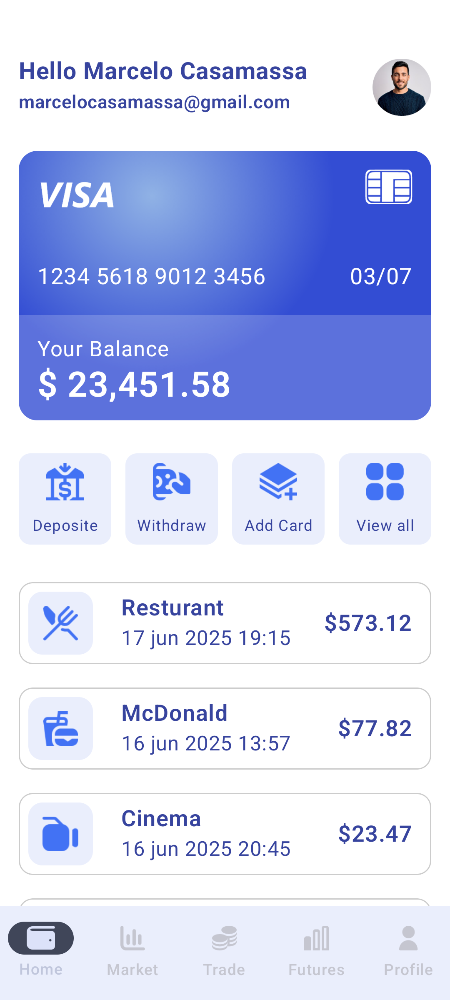
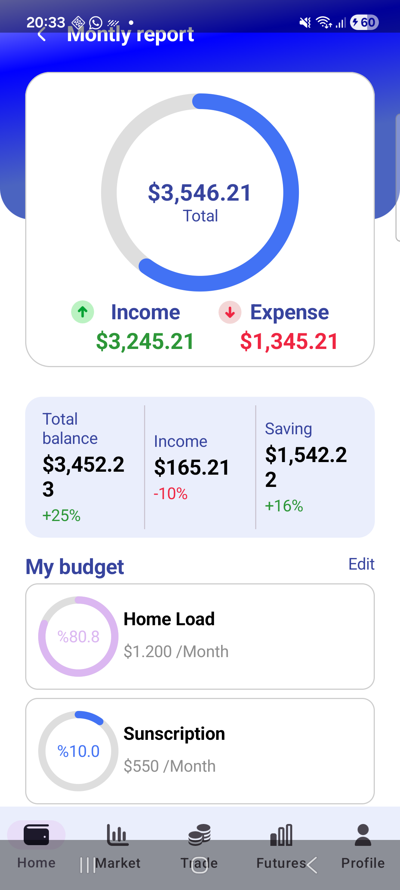

# 💰 MyMoney - Organizador Financeiro

O **MyMoney** é um aplicativo nativo para Android focado no gerenciamento e organização de finanças pessoais. Este projeto foi desenvolvido com o objetivo de consolidar conceitos avançados de construção de interfaces modernas, fluidas e reativas utilizando o **Jetpack Compose** e seguindo as diretrizes do **Material Design 3**.

> 💡 **Nota de Portfólio:** O foco principal deste projeto neste momento é a arquitetura de UI, padrões de layout e navegação. Os dados exibidos são simulados (*mockados*), servindo como uma base sólida de Frontend pronta para o acoplamento futuro de uma camada de dados (API/Banco de Dados).

---

## 📱 Demonstração

<table align="center">
  <tr>
    <td align="center">
      <h3>Intro</h3>
      
    </td>
    <td align="center">
      <h3>Transações</h3>
      
    </td>
    <td align="center">
      <h3>Dashboard</h3>
      
    </td>
    <td align="center">
      <h3>Navegação</h3>
      
    </td>
  </tr>
</table>

---

## 🛠️ Tecnologias e Ferramentas Utilizadas

- **Linguagem:** [Kotlin](https://developer.android.com/develop/ui/compose/kotlin) (100% Nativo)
- **Toolkit de UI:** [Jetpack Compose](https://developer.android.com/compose) (Abordagem declarativa)
- **Design System:** [Material Design 3](https://android.com) (Componentes modernos e acessíveis)
- **Gerenciador de Dependências:** Gradle (Kotlin DSL - `build.gradle.kts`)

---

## 📐 Arquitetura de Interface e Conceitos Aplicados

Durante o desenvolvimento das telas do MyMoney, foram aplicados conceitos essenciais exigidos pelo mercado de desenvolvimento Android atual:

### 1. Estrutura de Layout Base (`Scaffold`)
Utilização do componente estrutural `Scaffold` para gerenciar de forma limpa as barras persistentes do aplicativo, isolando de forma elegante a `NavigationBar` (barra inferior para alternância de abas) e a `TopAppBar` (telas de formulário).

### 2. Otimização de Listas com `Lazy Components`
Para garantir uma renderização de alta performance e livre de travamentos (*jank*), o histórico de transações e a listagem de contas utilizam o `LazyColumn`. Isso garante a reciclagem eficiente dos componentes na tela, simulando o comportamento ideal para grandes volumes de dados reais.

### 3. Componentização e Reutilização
A interface foi quebrada em pequenos blocos reaproveitáveis de funções `@Composable`. Componentes como os cards de saldo (receitas/despesas) e campos de entrada formatados foram parametrizados para evitar duplicação de código.

### 4. Gerenciamento de Estado de UI (`State`)
Uso correto das APIs de estado do Compose (`remember` e `mutableStateOf`) para controlar dinamicamente interações de interface em tempo de execução, como abertura de menus flutuantes (*Dropdowns*), filtros rápidos e seleções de tipo de transação (Entrada/Saída).

---

## 🚀 Próximos Passos (Roadmap de Evolução)

Para transformar esta interface em um produto completo, as seguintes etapas estão planejadas para o desenvolvimento lógico do app:
- [ ] **Gerenciamento de Estado Avançado:** Implementação do padrão de arquitetura **MVVM** com `StateFlow` e `ViewModels`.
- [ ] **Banco de Dados Local:** Persistência dos registros locais com a biblioteca oficial **Room Database**.
- [ ] **Injeção de Dependências:** Organização e modularização do código utilizando **Hilt** ou **Koin**.

---

## 💻 Como Executar o Projeto

1. Faça o clone do repositório:
   ```bash
   git clone https://github.com/casamassa/mymoney.git
   ```
2. Abra o projeto no **Android Studio** (versão Ladybug ou superior recomendada).
3. Espere a sincronização do Gradle terminar.
4. Execute o app em um Emulador ou Dispositivo Físico, ou visualize os componentes diretamente através do **Interactive Mode** do Preview do Compose.
